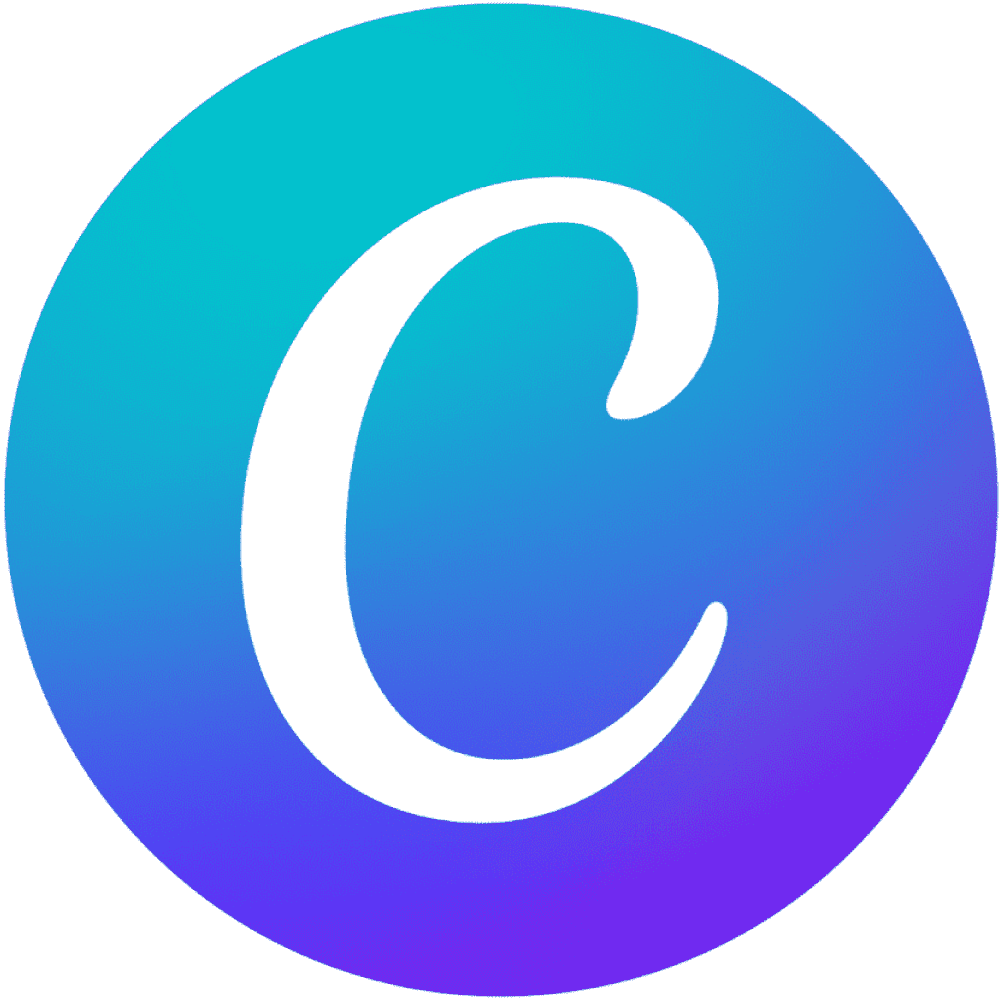

  

**Wordpress Developer** 🌐 | **Full Stack Web Developer** ⚡ | **Higher Technician** 🎓

"Committed to SOLID principles, Clean Code, and W3C standards" 💻
  

    
    
    
  

##  About me.

I'm Daniel Hidalgo a Junior <b>Full Stack Web Developer</b> focused on creating technological solutions using <b>MERN Stack</b> tools to generate real value through innovation and technical excellence. I am passionate about tech and I'm learning a bit more about it everyday.

##  Technical skills.

<table width="100%" align="center">
  <tr>
    <td width="50%">
      <h3 align="center"><strong>Front-end</strong></h3>
      

        

      

    </td>
    <td width="50%">
      <h3 align="center"><strong>Back-end</strong></h3>
      

        

      

    </td>
  </tr>
     
  <tr>
    <td width="50%">
      <h3 align="center"><strong>Databases</strong></h3>
      

        

      

    </td>
    <td width="50%">
      <h3 align="center"><strong>Development tools</strong></h3>
      

        
      

    </td>
  </tr>
  <tr>
    <td width="50%">
      <h3 align="center"><strong>Web design</strong></h3>
      

        
        
      

    </td>
    <td width="50%">
      <h3 align="center"><strong>Operating systems I've used</strong></h3>
      

        

      

    </td>
  </tr>
</table>
 

##  Achievements or awards.
- I have completed the [ACCESS Intensive English Microscholarship Program](https://idiomasifisa.com/access-microscholarship-program-2/) sponsored by the U.S. State Department for Venezuela.
- Member of the Venezuelan Access Alumni Network thanks to [EducationUSA](http://www.educationusa.state.gov/) and [IFISA](https://idiomasifisa.com/).

##  About my projects.

I will publish most of my projects right here on <b>GitHub</b> and <b>LinkedIn</b>, so check out <a href="https://github.com/soy-daniel-hidalgo?tab=repositories">the cool stuff I've built</a> so far. I'll pin the repositories that I am most proud of.

  <picture>
    <source media="(prefers-color-scheme: dark)" srcset="https://github.com/soy-daniel-hidalgo/soy-daniel-hidalgo/blob/output/github-snake-dark.svg" alt="GitHub snake dark theme" />
    <source media="(prefers-color-scheme: light)" srcset="https://github.com/soy-daniel-hidalgo/soy-daniel-hidalgo/blob/output/github-snake.svg" alt="GitHub snake light theme" />
    
  </picture>
   
  A snake's eating my GitHub contributions!

##  How to reach me.

- 💼 Want to know about my working experience or talk? - Visit my [LinkedIn profile.](https://linkedin.com/in/soy-daniel-hidalgo)

- 📧 Let's talk! - Email me at: [contact@danielhidalgo.dev](mailto:contact@danielhidalgo.dev)

- 🌐 Still curious? - Check out [my online portfolio.](https://danielhidalgo.dev/)
